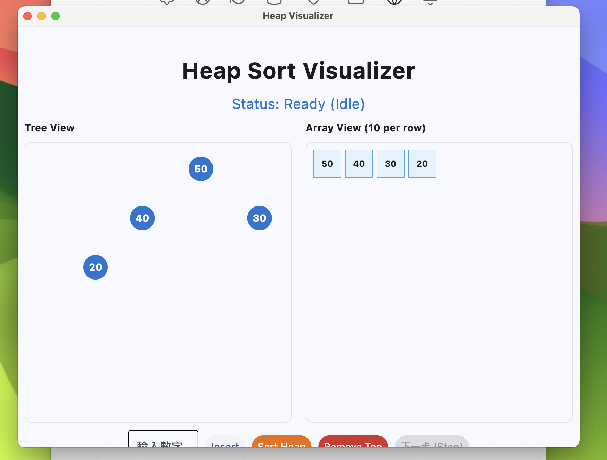
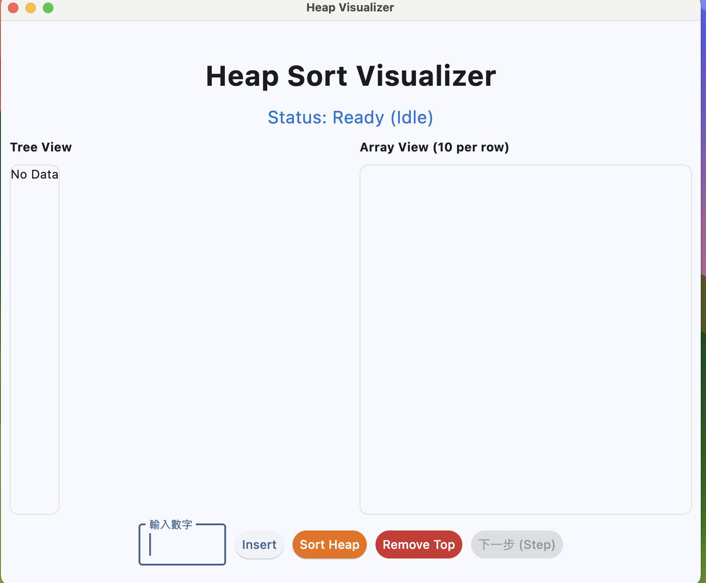

# QA 筆記 — 前端

紀錄前端測試發現的問題，包含讀程式碼 (static review) 跟實際跑起來操作時遇到的狀況。
參考檔：app.py、ui_components.py、state.py、README_backend.md (spec)。

測試版本：`demo` branch，commit `7a732ad`（feat: add heap_remove_top function，2026-05-12）。

---

# A. 讀程式碼發現的 (static)

## 1. 輸入框沒辦法打負數

`app.py` 第 88 行：
```python
if val_input.value.isdigit():
    backend.send_command(f"INSERT {val_input.value}")
```

`isdigit()` 對 `"-5"` 會回 False，所以這條 if 進不去 → 負數會被直接丟掉，沒送指令也沒提示。
spec 沒寫 heap 只能放正整數。
建議失敗的話顯示一下提示。

---

## 2. JSON 解析錯誤只有 print，UI 完全不知道

`app.py` 第 35 行：
```python
except Exception as e:
    print(f"IPC 解析錯誤: {e}")
```

只 print 到終端機，沒有呼叫 `on_state_update` 也沒更新任何畫面元件。
從這段程式看，後端如果送錯格式，前端沒有任何機制會讓畫面有反應。
建議在 except 裡也推一個錯誤狀態給畫面。

---

## 3. `_read_loop` 結束時沒通知 UI

`app.py` 第 22 行：
```python
def _read_loop(self):
    while True:
        line = self.proc.stdout.readline()
        if not line: break
```

`break` 之後 thread 就結束了，沒有任何 callback 通知主畫面「後端不在了」。
按鈕的 enable/disable 是靠 `handle_state_update` 改的，這個 callback 不會再被叫到，
所以後端如果中途掛掉，畫面狀態會停在最後一刻不動，沒有提示。

---

## 4. ui_components.py 有一行跑不到

第 29~31 行：
```python
return f"Action: {state.event} in progress..."
return f"Status: {state.event} in progress..."   # 永遠跑不到
```

兩個 return 連在一起，第二個一定執行不到。看起來像改一改忘記刪。直接刪掉。

---

## 5. spec 寫的事件名稱跟前端對不起來

README_backend.md 第 4 節列了 7 個事件：
`INSERTED / EXTRACTED / UPDATED / COMPARE / SWAP / DONE / IDLE`

但 `ui_components.py` 的 `get_status_text` 處理的是：
`INSERT`、`EXTRACT_PREPARE`、`EXTRACT_SWAP`、`REMOVED_START_SIFT`、`SWAP`、`COMPARE`、`DONE`

`COMPARE / SWAP / DONE / IDLE` 對得上，但 `INSERTED`、`EXTRACTED`、`UPDATED` 沒人接。
未來如果後端真的照 spec 出貨，這幾個 event 會掉到第 29 行的 fallback `Action: {event} in progress...`，
沒有專屬的說明文字。


---

# B. 實際跑起來才發現的 (操作)

## 6. 不知道「下一步」按鈕什麼時候要按

跑 app.py 操作的時候，按了 Insert 之後畫面動一下就停住，其他按鈕都灰掉，只剩「下一步」亮著。
但畫面上沒有任何文字告訴使用者「現在請按下一步」，看著一動也不動的畫面，第一直覺會以為是當機。

建議在 status 文字加一句「（請按下一步繼續）」，或讓「下一步」按鈕亮起時改顏色 / 閃爍提示。

---

## 7. 在 MacBook Air 上開起來，最下面按鈕會被切掉

在我的 MacBook Air（螢幕高度大概 900px）開 app.py，視窗一打開最下面那排按鈕（輸入框、Insert、Sort、Remove、下一步）整排被切掉，要手動把視窗往下拉、或拖大才看得到。



---

## 8. 空輸入、多個整數、abc、負數按 Insert 都沒反應

輸入框留空、多個整數、打英文字母 `abc`、打負數 `-5`，按 Insert 之後畫面什麼都沒發生，也沒跳錯誤訊息。
使用者會搞不清楚是按鈕壞了還是自己輸入錯。
至少要顯示「請輸入一個正整數」之類的提示。

---

## 9. 一直按 Remove 變空之後畫面有點怪

把 heap 一直 Remove 到空為止，Tree View 跑出「No Data」文字、Array View 整個空白。
有幾個地方看起來怪怪的：

- 「No Data」文字直接出現在左上角，沒置中也沒包邊框，跟原本有資料時的樣式落差很大
- Array View 完全空白，連「Empty」或類似提示都沒有，第一眼會懷疑是壞掉

建議空heap時兩邊都顯示置中的提示文字，至少看起來像設計過的空狀態。



---

# C. pytest 單元測試

寫在 `test_frontend.py`，目前 5 個，全部通過。

跑法：
```bash
source .venv/bin/activate
pytest test_frontend.py -v
```

測什麼：

1. `test_idle_should_say_ready` — IDLE 狀態要顯示 Ready
2. `test_compare_shows_target_indices` — COMPARE 事件要把 target index 顯示出來
3. `test_unknown_event_should_not_crash` — 亂打的 event 不該讓程式炸掉
4. `test_spec_INSERTED_falls_to_fallback` — spec 寫 INSERTED 但前端沒接，會掉到 fallback
5. `test_visual_state_defaults` — VisualState 不傳參數時要是 IDLE / 空 list

---
