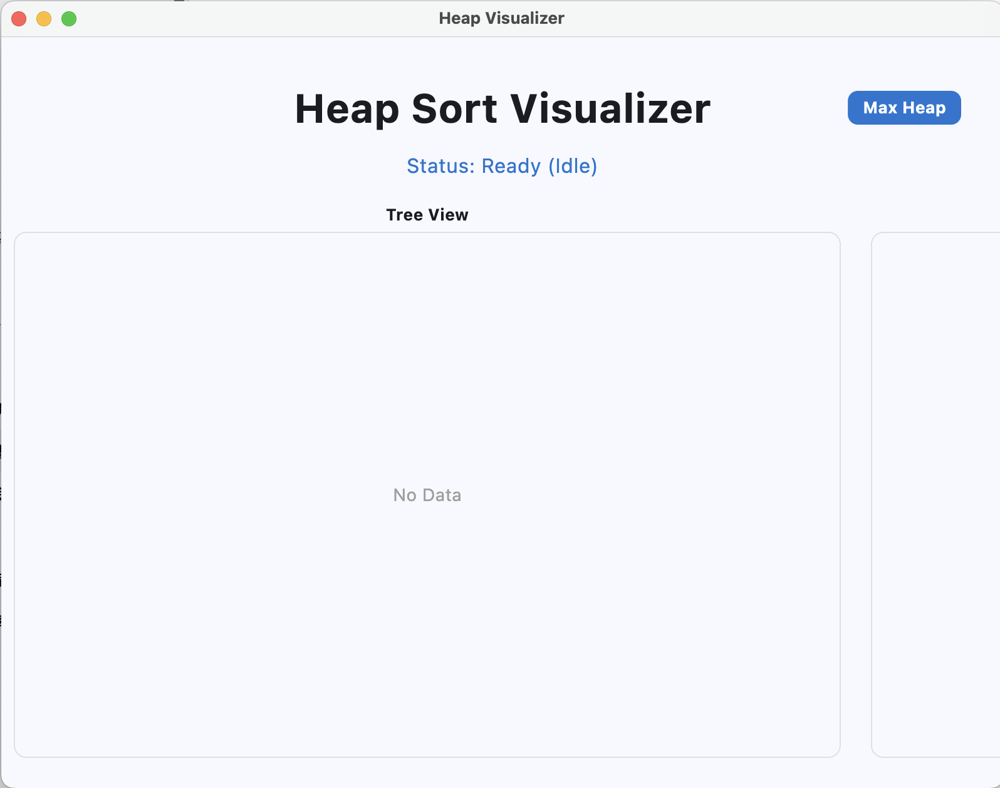
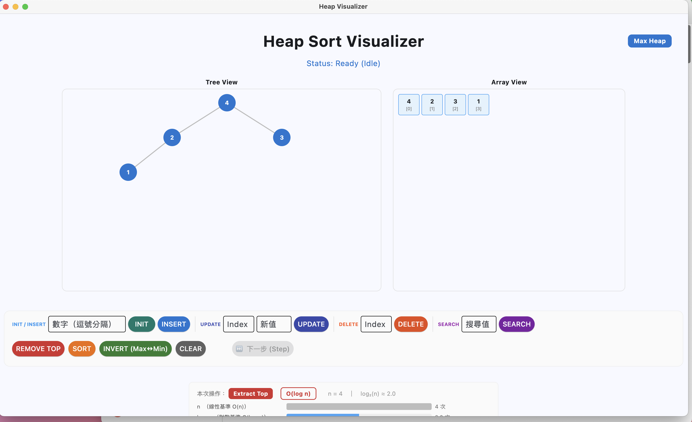

# final QA 整理

最後一輪整體 QA，回頭看 FE_QA.md / BE_QA.md 提到的問題現在怎麼樣，加上實際操作 end-to-end 試完的結果。

測試版本：`demo-ai-integrated` branch，commit `f7b5fe0`（feat: 對接後端功能並優化多項 Demo 缺陷 (AI 協助版本)），加上本次再做的 EXTRACT_SWAP 文案微調。

---

# 1. 前端問題現況（對應 FE_QA.md）

| FE_QA 編號 | 問題 | 現在狀態 |
|---|---|---|
| #1 輸入框沒辦法打負數 | 用 `isdigit()` 擋掉負數 | ✅ 已解，`app.py` 加了 `parse_int_list` / `parse_int` 用 `int()` 解析 |
| #2 JSON 解析錯誤只有 print | except 只 print 到終端機 | ❌ 還沒解，except 仍是 `print(...)` |
| #3 `_read_loop` 結束時沒通知 UI | 後端掛掉前端不知道 | ❌ 還沒解 |
| #4 ui_components.py 有一行跑不到 | 兩個 return 連寫 | ✅ 已解，ui_components 整個重寫了，死碼不見 |
| #5 spec 事件名稱跟前端對不起來 | INSERTED / EXTRACTED / UPDATED 沒人接 | ✅ 已解，ui_components 加了對應的中文文案 |
| #6 不知道「下一步」按鈕什麼時候要按 | 沒提示 | ✅ 已解，目前下一步按鈕會閃爍 |
| #7 MacBook Air 視窗下方按鈕被切掉 | window_height 沒設 | ❌ 還沒解，情況變更嚴重（見下方新發現） |
| #8 空輸入 / abc / 負數沒提示 | 沒驗證沒提示 | ✅ 已解有在欄位下顯示「請輸入整數」提示 |
| #9 Remove 變空畫面有點怪 | No Data 沒置中 | ✅ 已解No Data有置中、灰色文字 |

---

# 2. 後端 / spec 問題現況（對應 BE_QA.md A 區）

| BE_QA A 編號 | spec 模糊點 | 現在狀態 |
|---|---|---|
| A-1 重複值 sift down 左右選擇 | spec 沒寫 | ❌ spec 還沒補 |
| A-2 INIT 不帶值的行為 | spec 沒寫 | ❌ spec 還沒補 |
| A-3 INSERT 滿堆時的行為 | spec 沒寫 MAX_SIZE | ❌ spec 還沒補 |
| A-4 INIT 多值建構方法 | spec 沒寫 | ❌ spec 還沒補（實作用 bottom-up） |
| A-5 SORT 排序方向、destructive | spec 沒寫 | ⚠️ 實作改成非 destructive（B-1 解決一部分），但 spec 還沒補 |

A 區屬於組員之間的 spec 規範問題，QA 只是把模糊點列出來，要組員決定。

---

# 3. 新發現的展示問題

這次跑 demo 又抓到兩個視窗切到的狀況。

## 3-1. 程式一開起來預設視窗就切到很多

開啟 `flet run app.py` 後預設視窗大小已經切到下半部，必須手動拉大才看得到所有按鈕跟複雜度面板。



跟 FE_QA #7 同一類問題，但這次切得更嚴重，整個下半部都看不到。
原因：`app.py:67` 寫 `page.window_width = 1200`，沒設 `window_height`，預設高度撐不下內容。

## 3-2. 就算放到螢幕最大，下面複雜度面板還是會被切

把視窗拉到螢幕最大，仍然看不到完整的「時間複雜度」面板（長條圖那一塊）。



代表「Heap Visualizer + 時間複雜度面板」這個排版總高度 **超過螢幕本身**（在 MacBook Air 上）。

兩個處理方向：
- **做演示時只展示上面那塊（Heap 視覺化）**，跳過複雜度面板
- 或前端把整塊用 `ft.Column(scroll=ScrollMode.AUTO)` 包起來，讓畫面可捲動

短期內為了展示，建議**只展示上半部**。長期建議改成可捲動。

---

# 4. End-to-End 操作測試結果

實際打開 app.py 把每個按鈕都按過一輪：

- Insert（單值、逗號分隔多值）：OK
- Remove Top：OK，但有第 5 節的 overwrite 文案問題
- Sort Heap：OK，有看到藍 → 橘 → 灰的演進，按完最後一步還原回原本 max heap
- Update：OK
- Delete：OK
- Invert（Max/Min 切換）：OK
- Clear：OK
- Search：OK
- 下一步 (Step)：OK

**除了第 5 節的 overwrite 文案小問題之外，沒有遇到會讓使用者卡住或畫面崩掉的重大問題。**

---

# 5. 這次改的 code：EXTRACT_SWAP 的 overwrite 文案

## 問題

`heap_extract_top` 內部是 overwrite（不是 swap）：

```c
h->data[0] = h->data[h->size - 1];   // 用最後節點覆寫 root
```

`ui_components.py` 原本對應的 EXTRACT_SWAP 文字寫「對調」，跟實作不符。實際畫面會看到「Root 跟尾端變成兩個一樣的值」這種看起來像 bug 的中間狀態。

## 改動

`ui_components.py` 改一條文案：

| 事件 | 原本 | 改成 |
|---|---|---|
| EXTRACT_SWAP | 「將 Root 與最後節點 {t} 對調...」 | 「用最後節點覆寫 Root {t}（原 Root 已取出）...」 |

這樣使用者看到「兩個一樣的值」時不會以為 bug — 文字會說「用最後節點覆寫」。

DELETE 也是用 overwrite 但動畫不容易看出來這個現象（不像 EXTRACT 是 root 跟尾端那麼明顯），所以 DELETE_PREPARE / DELETE_SWAP 文案就先不動。

---

# 6. 測試重跑結果

## 6-1. 後端 mock_app.py（合約測試）

`python mock_app.py --all --exe ./backend` 全部 15 條過：

```
✅ Case 1:  INIT 多值建 heap (bottom-up)
✅ Case 2:  INSERT 一路 sift 到 root
✅ Case 3:  EXTRACT 連續多次
✅ Case 4:  UPDATE 改大要 sift up
✅ Case 5:  UPDATE 改小要 sift down
✅ Case 6:  DELETE 中間節點
✅ Case 7:  SORT 排序結果
✅ Case 8:  邊界：DELETE 最後一個 index（不需 sift）
✅ Case 9:  邊界：從空 heap INSERT 再 EXTRACT 變回空
✅ Case 10: 混合：INIT + INSERT + EXTRACT + UPDATE
✅ Case 11: 邊界：INIT 只放一個值
✅ Case 12: 邊界：DELETE root 應等同 EXTRACT
✅ Case 13: 混合：連續 INSERT 多次後連續 EXTRACT
✅ Case 14: 混合：INIT 後兩個不同方向的 UPDATE
✅ Case 15: 混合：SORT 後再INSERT

共 15 條，通過 15，失敗 0
```

後端演算法在所有指令上行為正確。

## 6-2. 前端 pytest

`pytest QA/test_frontend.py -v` 現在 3 過 2 fail：

```
✅ test_idle_should_say_ready              PASSED
❌ test_compare_shows_target_indices       FAILED
✅ test_unknown_event_should_not_crash     PASSED
❌ test_spec_INSERTED_falls_to_fallback    FAILED
✅ test_visual_state_defaults              PASSED

2 failed, 3 passed
```

兩條 fail 都是因為 `ui_components.py` 的文字從英文改成中文後，原本的assert對不上：

- `test_compare_shows_target_indices` 期待 `"Compar"` in text，但新文案是「比較節點 ...」
- `test_spec_INSERTED_falls_to_fallback` 期待 `"in progress"` in text（驗證 fallback），但 INSERTED 現在有專屬中文文案「新節點插入位置 ...」

第二條的 fail 其實是好事 — 代表 FE_QA #5（INSERTED 沒人接、會掉 fallback）的 bug 已經修了。
程式本身沒問題，**只是測試assert沒跟上字串改動**，先留著不改。

---

# 7. 還沒處理的東西

- FE_QA #2 / #3：IPC 錯誤跟後端掛掉的處理（影響穩定性，但 demo 環境不太會觸發）
- 視窗大小寫死 / 沒 scroll（3-1、3-2）— 建議展示時只看上半部

整體可以交差。
